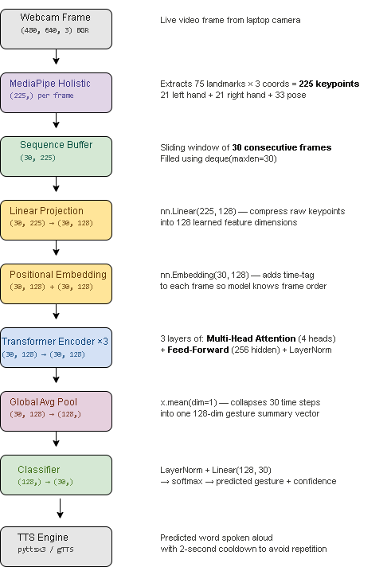

<div align="center">
  
  
  <h1>♿ SensAI</h1>
  <p><b>Multimodal Accessibility AI Studio — Modern Glassmorphism Edition</b></p>

  <!-- Tech Stack Badges -->
  <p>
    
    
    
    
    
    
    
  </p>

  <!-- GitHub Stats Badges -->
  <p>
    
    
    
  </p>
</div>

<hr/>

## 🌟 About SensAI
SensAI is a comprehensive **Multimodal Accessibility Assistant Studio** designed to bridge communication and sensory gaps using state-of-the-art AI models. It features a unified, responsive **Dark Space & Glassmorphic Dashboard** that integrates five major assistive modes, providing real-time text-to-speech, computer vision, natural language processing capabilities, and interactive simple-language guidance.

Supports **English** and **Bengali**.

## ✨ What's New in v3.2 (Modern UI Transformation)
- **Stitch AI Front-End Landing Page Integration**: Added a pixel-perfect, glassmorphic Home Landing Page (`views/landing_page.py`) featuring interactive top navigation, "Meet Nova AI" live showcase, 4-column Core Capabilities grid, testimonials, and newsletter subscription connected to existing application routes.
- **Synchronized Dark Mode / Light Mode Switcher**: Interactive sidebar theme toggle switching between **Dark Space Glassmorphism** (`#090b14`) and **Daylight Studio Glassmorphism** (`#f8fafc`) with dynamic CSS token synchronization across all components.
- **Glassmorphism Design System**: Frosted glass cards (`backdrop-filter: blur(16px)`), neon gradient borders, and micro-animations.
- **Modern Google Fonts Typography**: Styled with *Plus Jakarta Sans* for headers and *Inter* for body readability.
- **Enhanced Assistive Mode Dashboards**:
  - **🤟 Sign Language Studio**: Live gesture translation with an interactive **Sentence Construction History Bar** and instant full-sentence audio playback.
  - **📖 Bilingual OCR Studio**: Dual-pane drag-and-drop document studio with extracted text playback and `.txt` export.
  - **😊 Affective Emotion Companion**: Live emoji mood dashboard with colorful horizontal confidence breakdown bars.
  - **🌍 BLIP-2 Vision AI Studio**: High-contrast accessible scene descriptions for visually impaired users.
  - **🤖 Nova AI Studio**: Context-aware assistant with interactive quick-action chips, numbered tutorial cards, and smart camera checklists.

## 🛠️ System Architecture

Below is the high-level system architecture outlining the core flow of SensAI:

<div align="center">
  
</div>

The application serves five primary modes:
1. **🤖 Nova — AI Accessibility Assistant**: Context-aware companion providing simple-language explanations, interactive tutorials, and troubleshooting diagnostics.
2. **🤟 Sign Language to Speech**: Live keypoint extraction using MediaPipe, classified via PyTorch models to translate Indian Sign Language (ISL) gestures to spoken words.
3. **📖 Printed Text to Speech (OCR)**: Leverages Tesseract OCR and `pyttsx3`/`gTTS` to extract text from images or live camera feeds and read it aloud.
4. **😊 Facial Emotion to Speech**: Uses DeepFace and Keras to detect user emotions in real-time, providing spoken contextual feedback (useful for autism support).
5. **🌍 Scene Description to Speech**: Utilizes Hugging Face Transformers (e.g., BLIP-2) to generate rich, descriptive text of a visual scene and reads it out for visually impaired users.

## 🚀 Getting Started

### Prerequisites
Make sure you have Python installed.

### Installation

1. **Clone the repository**
   ```bash
   git clone https://github.com/Sourita1308/SensAI.git
   cd SensAI
   ```

2. **Install dependencies**
   ```bash
   pip install -r requirements.txt
   ```

3. **Run the Application**
   ```bash
   streamlit run app.py
   ```

## 📅 Daily Push Log Table

| Date | Commits / Updates | Author | Status |
| :--- | :--- | :--- | :--- |
| **2026-08-02** | Integrated Stitch AI exported front-end landing page into SensAI Studio with interactive route switching, preserving 100% backend logic | Sourita1308 | 🟢 Completed |
| **2026-08-01** | Transformed SensAI legacy UI into modern Glassmorphic AI Studio with synchronized Dark/Light Mode switcher, Google Fonts, and neon interactive dashboards | Sourita1308 | 🟢 Completed |
| **2026-05-30** | Updated README with modern UI & badges | Sourita1308 | 🟢 Completed |
| **YYYY-MM-DD** | Add your next update here | Sourita1308 | 🟡 In Progress |

> **Note**: Update this table daily to keep track of your feature pushes and progress.

## 📊 GitHub Activity
To automatically track daily pushes, below is the real-time GitHub activity graph:
<div align="center">
  
</div>
